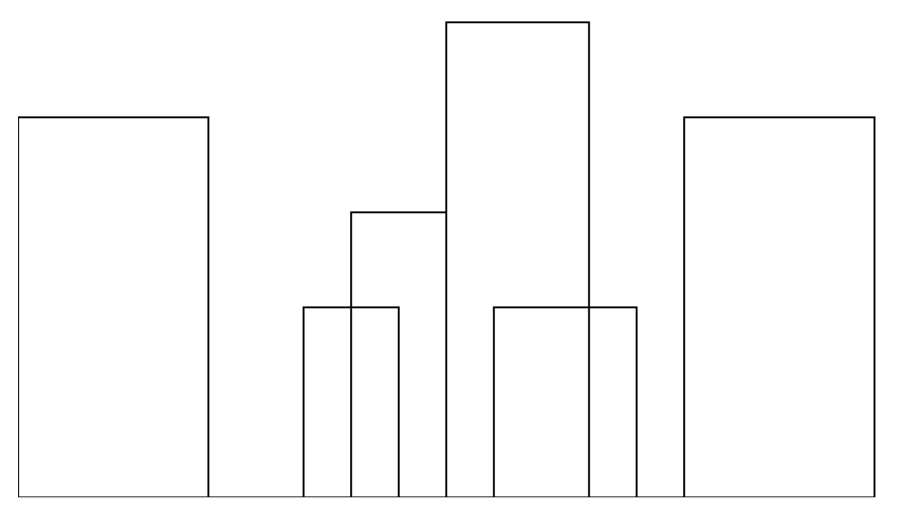

# Skyline.js

Read the problem statement from [Brian Gordon's blog](https://www.instapaper.com/read/507825349),
and thought I'd give it a shot without reading any further.

> You are given a set of n rectangles in no particular order.
> They have varying widths and heights, but their bottom edges are
> collinear, so that they look like buildings on a skyline.
> For each rectangle, you’re given the x position of the left edge,
> the x position of the right edge, and the height. Your task is to draw an
> outline around the set of rectangles so that you can see what the skyline
> would look like when silhouetted at night.

Example:


## Progress

I've started out with this data and will work from there:

```javascript
var data = [
{x1: 0,   x2: 200, height: 400},
{x1: 300, x2: 400, height: 200},
{x1: 350, x2: 450, height: 300},
{x1: 450, x2: 600, height: 500},
{x1: 500, x2: 650, height: 200},
{x1: 700, x2: 900, height: 400},
];
```

My current output:


