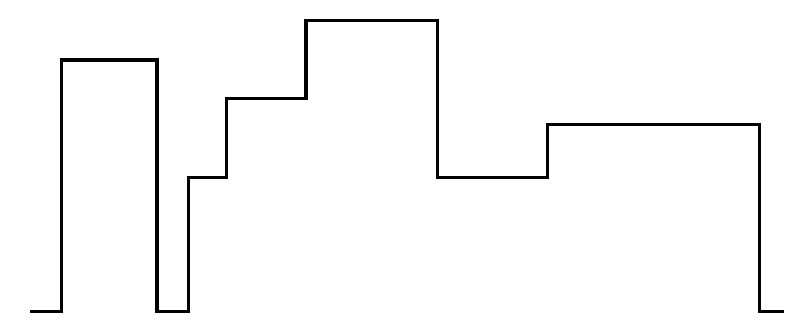

# Skyline.js

Read the problem statement from [Brian Gordon's blog](https://www.instapaper.com/read/507825349),
and thought I'd give it a shot without reading any further.

> You are given a set of n rectangles in no particular order.
> They have varying widths and heights, but their bottom edges are
> collinear, so that they look like buildings on a skyline.
> For each rectangle, you’re given the x position of the left edge,
> the x position of the right edge, and the height. Your task is to draw an
> outline around the set of rectangles so that you can see what the skyline
> would look like when silhouetted at night.

Example:

## Progress

[Read about my progress here](http://cfurrow.github.io/2014/09/02/the-skyline-problem/)
